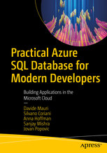

# Dapper .NET Samples
## Samples that shows how to use Dapper .NET.

These are the samples mentioned in the [Dapper .Net](https://github.com/StackExchange/Dapper) publication on Medium:

[https://medium.com/dapper-net](https://medium.com/dapper-net)

Here's the list of samples and the related article:

 1. [Getting Started with Dapper .NET](https://medium.com/dapper-net/get-started-with-dapper-net-591592c335aa)
 2. [Multiple Executions](https://medium.com/dapper-net/multiple-executions-56c410e9f8dd)
 3. [Multiple Resultsets](https://medium.com/dapper-net/handling-multiple-resultsets-4b108a8c5172)
 4. [Multiple Mapping](https://medium.com/dapper-net/multiple-mapping-d36c637d14fa)
 5. [SQL Server Features](https://medium.com/dapper-net/sql-server-specific-features-2773d894a6ae)
 6. [Custom Mapping](https://medium.com/dapper-net/custom-columns-mapping-1cd45dfd51d6)
 7. [Custom Handling](https://medium.com/dapper-net/custom-type-handling-4b447b97c620)
 8. [One-To-Many Relationships](https://medium.com/dapper-net/one-to-many-mapping-with-dapper-55ae6a65cfd4)
 9. [Complex Custom Handling](https://medium.com/dapper-net/one-to-many-mapping-with-dapper-55ae6a65cfd4)

Please note that the "One-To-Many Relatioships" and "Complex Custom Handling" points to the same articles since both topics are discussed there as they are strictly related to each other.

## Running The Samples

To run the "Basic Samples", related to the first article "Getting Started with Dapper .NET", just run

```dotnet run -f net5.0```

from

```Dapper.Samples.Basics```

folder. To run advanced samples you have to move into 

```Dapper.Samples.Advanced```

and then from here you can just run

```dotnet run -f net5.0```

to run ALL samples or 

```dotnet run -f net5.0 "Sample Name"```

to run that specific sample. Eg:

```dotnet run -f net5.0 "Multiple Executions"```

to run only the "Multiple Execution" sample.

To have a list of all advanced samples available run:

```dotnet run -f net5.0 -help```

## Notes

### .NET Version

Samples are done using [.NET 5.0](https://dotnet.microsoft.com/download/dotnet/5.0), and [.NET Framework 4.8](https://www.microsoft.com/net/download/windows): make sure you have them installed it on your machine

The project supports multiple targets:

* net5.0
* netcoreapp3.1
* net48

To execute the application targeting one specific framework, just use the `-f` option when running the console app:

```dotnet run -f net5.0```

more info on the `-f` option here:

[dotnet run](https://docs.microsoft.com/en-us/dotnet/core/tools/dotnet-run)

If you are looking for samples supporting older version, take a look at the previous releases as they support also:

* .NET Framework 4.5.2
* .NET Core 2.0
* Dapper 1.50

### SQL Server

Samples also use SQL Server as database server. If you don't have a Windows machine, you can use the Docker version: [SQL Server 2017](https://www.microsoft.com/en-us/sql-server/sql-server-2017). 
SQL Server database file is attached automatically using the `LocalDB/MSSQLServer` instance. If you prefer to use a non-local instance, make sure you change the connection string accordingly, and attach the database file to your instance.


### OPENJSON and 2K limit

In Azure SQL and SQL Server, when JSON is returned as part of a SELECT ... FOR JSON, if the resulting JSON is bigger than 2K, it will be chunked and thus it must be put back together on the client. Using SQL Server Management Studio you will not see any of this as it automatically do this for you, but if you using .NET you have to do it yourself as described here: [User FOR JSON output in a C# client app](https://docs.microsoft.com/en-us/sql/relational-databases/json/use-for-json-output-in-sql-server-and-in-client-apps-sql-server). This is actually true for other languages and not only for C#.
A bit more detail on this behavior here: [SQL Server JSON result separated in multiple rows](https://stackoverflow.com/questions/41880611/sql-server-json-result-separated-in-multiple-rows/41915103#41915103).

The samples have been updated to show how to properly manage this behavior, as also described in this post by MVP Hasan Savran: [JSON Challenges for DEVS in SQL Server](https://h-savran.blogspot.com/2020/04/challenges-with-returning-data-as-json.html). 

The "trick" is to wrap FOR JSON in another SELECT or assign it to a variable:

```sql
SELECT (
	SELECT	
		u.Id,
		u.FirstName,
		u.LastName,
		u.EMailAddress AS 'EmailAddress',
		(SELECT JSON_QUERY(REPLACE(REPLACE((SELECT [Tag] FROM dbo.[UserTags] t WHERE t.UserId = u.Id FOR JSON PATH), '{"Tag":', ''), '}', ''))) AS Tags,
		JSON_QUERY((SELECT r.[value] as [RoleName] FROM dbo.[Users] ur CROSS APPLY STRING_SPLIT(Roles, ',') AS r WHERE ur.Id = u.Id FOR JSON AUTO)) AS Roles,
		u.Notes,
		c.Id AS 'Company.Id',
		c.CompanyName AS 'Company.CompanyName',
		c.Street AS 'Company.Address.Street',
		c.City AS 'Company.Address.City',
		c.[State] AS 'Company.Address.State',
		c.Country AS 'Company.Address.Country',
		JSON_QUERY(u.CustomData, '$.Preferences') AS Preferences
	FROM
		dbo.[Users] u
	LEFT JOIN
		dbo.[Companies] c ON u.CompanyId = c.Id
	WHERE
		u.id = @id
	FOR JSON PATH, WITHOUT_ARRAY_WRAPPER
) as [object]
```

## Learn More

If you want to learn more on how to create modern application with SQL Server and Azure SQL, the following book is for you:

[](https://www.apress.com/it/book/9781484263693)

### About This Book

Here is the expert-level, insider guidance you need on using Azure SQL Database as your back-end data store. This book highlights best practices in everything ranging from full-stack projects to mobile applications to critical, back-end APIs. The book provides instruction on accessing your data from any language and platform. And you learn how to push processing-intensive work into the database engine to be near the data and avoid undue networking traffic. Azure SQL is explained from a developer's point of view, helping you master its feature set and create applications that perform well and delight users.

Core to the book is showing you how Azure SQL Database provides relational and post-relational support so that any workload can be managed with easy accessibility from any platform and any language. You will learn about features ranging from lock-free tables to columnstore indexes, and about support for data formats ranging from JSON and key-values to the nodes and edges in the graph database paradigm. Reading this book prepares you to deal with almost all data management challenges, allowing you to create lean and specialized solutions having the elasticity and scalability that are needed in the modern world. 

### What You Will Learn

Master Azure SQL Database in your development projects from design to the CI/CD pipeline
Access your data from any programming language and platform
Combine key-value, JSON, and relational data in the same database
Push data-intensive compute work into the database for improved efficiency
Delight your customers by detecting and improving poorly performing queries
Enhance performance through features such as columnstore indexes and lock-free tables
Build confidence in your mastery of Azure SQL Database's feature set


### Who This Book Is For
Developers of applications and APIs that benefit from cloud database support, developers who wish to master their tools (including Azure SQL Database, and those who want their applications to be known for speedy performance and the elegance of their code